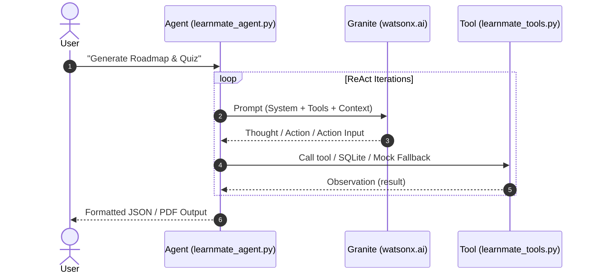

# LearnMate – Architecture & Request/Response Lifecycle

> **Stack:** React 18 · Express.js · IBM Granite 3.0 AI · SQLite (better-sqlite3) · JWT Auth

---

## System Architecture Overview

```
┌─────────────────────────────────────────────────────────────────────┐
│  FRONTEND (React 18 + Tailwind CSS)                                 │
│  ┌──────────────┐  ┌──────────────────┐  ┌───────────────────────┐ │
│  │ AuthModal    │  │ OnboardingWizard │  │ RoadmapDashboard      │ │
│  │ (JWT tokens) │  │ (3-step wizard)  │  │ + QuizModal           │ │
│  │              │  │                  │  │ + ProfileDrawer       │ │
│  └──────────────┘  └──────────────────┘  └───────────────────────┘ │
│           │                 │                        │              │
│           └─────────────────┴──────────── api.js ───┘              │
└─────────────────────────────────────────────────────────────────────┘
                              │ HTTP/REST (Bearer JWT)
┌─────────────────────────────────────────────────────────────────────┐
│  BACKEND (Express.js + Node.js)                                     │
│  ┌──────────┐  ┌──────────────┐  ┌──────────┐  ┌────────────────┐ │
│  │ /auth    │  │ /roadmap     │  │ /quiz    │  │ /ask           │ │
│  │ register │  │ generate     │  │ generate │  │ study asst.    │ │
│  │ login    │  │ adapt        │  │ result   │  │ (optional)     │ │
│  │ me       │  │ progress     │  │          │  │                │ │
│  └──────────┘  └──────────────┘  └──────────┘  └────────────────┘ │
│       │               │                │                            │
│  ┌────▼───────────────▼────────────────▼──────────────────────┐    │
│  │  middleware/auth.js — requireAuth (JWT verify)             │    │
│  └────────────────────────────────────────────────────────────┘    │
│       │               │                                             │
│  ┌────▼──────┐  ┌──────▼─────────────────────────────────────┐    │
│  │ SQLite DB │  │  services/watsonx.js → IBM Granite 3.0 API │    │
│  │ (better-  │  │  + mockFallback.js (rate-limit fallback)    │    │
│  │ sqlite3)  │  └────────────────────────────────────────────┘    │
│  └───────────┘                                                      │
└─────────────────────────────────────────────────────────────────────┘
```

---

## Agent Sequence Diagram



---

## File Structure

```
Course Pathway Agent/
├── backend/
│   ├── .env                        ← Watsonx credentials
│   ├── server.js                   ← Express entry point
│   ├── data/
│   │   └── learnmate.db            ← SQLite database (auto-created)
│   ├── db/
│   │   └── database.js             ← Schema + prepared statements
│   ├── middleware/
│   │   └── auth.js                 ← JWT requireAuth + signToken
│   ├── routes/
│   │   ├── auth.js                 ← register / login / me
│   │   ├── roadmap.js              ← generate / adapt / progress / list
│   │   ├── quiz.js                 ← generate quiz / submit result
│   │   └── ask.js                  ← AI study assistant
│   └── services/
│       ├── watsonx.js              ← Granite API + cleanAndParseJSON
│       └── mockFallback.js         ← Fallback data when API fails
└── frontend/
    ├── public/index.html
    ├── tailwind.config.js
    └── src/
        ├── App.js                  ← Root view controller + auth state
        ├── index.js / index.css    ← Entry + global styles
        ├── services/
        │   └── api.js              ← All API calls + token management
        ├── utils/
        │   ├── exportRoadmap.js    ← html2pdf.js PDF export
        │   └── storage.js          ← localStorage persistence hook
        └── components/
            ├── AuthModal.jsx       ← Register / Login form
            ├── OnboardingWizard.jsx← 3-step interest/skill/time wizard
            ├── LoadingRoadmap.jsx  ← AI generation loading screen
            ├── RoadmapDashboard.jsx← Timeline, module cards, stats
            ├── QuizModal.jsx       ← 10-Q quiz + remediation panel
            └── ProfileDrawer.jsx   ← XP, level, completed checklist
```

---

## Data Flow Summary

| Action | Frontend | Backend | AI | DB |
|--------|---------|---------|----|----|
| Register/Login | AuthModal | `/api/auth/*` | — | INSERT/SELECT users |
| Generate Roadmap | OnboardingWizard → Loading | `/api/roadmap/generate` | Granite prompt | INSERT roadmaps |
| Toggle Module | ModuleCard node click | `/api/roadmap/progress` | — | UPSERT module_progress |
| Take Quiz | QuizModal | `/api/quiz` + `/api/quiz/result` | MCQ + remediation | INSERT quiz_results |
| Export PDF | ExportButton | — (client-side) | — | — |
| View Profile | ProfileDrawer | `/api/auth/me` | — | SELECT stats |

---

*Generated by LearnMate AI · Granite 3.0 Engine*
